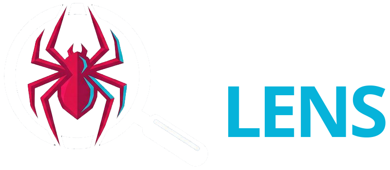
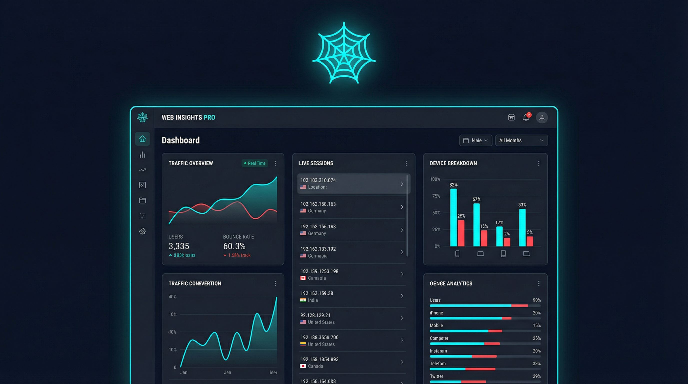

<div align="center">
  

  # Spider-Lens

  **SEO-focused server log analyzer — open-source, self-hosted**

  [](#)
  [](#)
  [](#)
  [](#)
  [](#)

</div>

---



---

Spider-Lens reads your Apache/Nginx log files and provides a comprehensive dashboard to monitor your traffic, HTTP errors, crawl bots, and server performance (TTFB). Powered by an AI assistant — **Nova** — that analyzes your SEO data and answers your questions in real time. Available as a standalone Node.js app **and** as a native WordPress plugin.

---

## ✨ Features

| View | Description |
|------|-------------|
| **Dashboard** | Summary KPIs: human visits, bots, error rate, HTTP codes, hourly/daily charts |
| **HTTP Codes** | Filterable table (2xx/3xx/4xx/5xx) + URL drill-down + User-Agent filter + CSV & Excel export |
| **Top Pages** | Most visited pages + 404 list to fix, sortable columns |
| **Bots & Crawlers** | Detection of 16+ bots (Googlebot, AhrefsBot, SemrushBot, ClaudeBot…) with dedicated charts |
| **TTFB** | Time To First Byte per URL, configurable threshold, CSV & Excel export |
| **Network** | IP and user-agent analysis — bot/human filters, sortable columns, direct block action |
| **Anomalies** | Automatic detection: traffic spikes, high error rates, missing Googlebot, unknown bot surges |
| **Blocklist** | Block suspicious IPs and user-agents directly from the interface |
| **Analyse IA** | AI-powered SEO analysis: global score, detected problems, actionable recommendations |
| **Settings** | SMTP alerts, retention policy, database management, password & username change |

### More

- 🤖 **Nova AI assistant** — Floating chat bubble on every page. Nova automatically receives the current page context when you ask a question (never on navigation). SSE streaming, session history, Nova avatar. Powered by Gemini 3 Flash Preview.
- 🌍 **i18n** — UI available in FR, EN, ES, DE, IT, NL (persisted via localStorage)
- 🔒 **JWT authentication** — 7-day token, secure session
- 📧 **Email alerts** — 404 spikes, 5xx errors, missing Googlebot (configurable SMTP)
- 📊 **Incremental parsing** — Resume from offset, log rotation detection
- 🌱 **Beginner mode** — Help banners and contextual tooltips, dismissible
- 🌐 **Multi-site** — Monitor multiple sites from a single interface
- 🗄️ **Database management** — Real-time stats (size, rows per table, date range), configurable retention policy, manual purge + VACUUM with inline feedback
- 🎨 **Polished UI** — Framer Motion animations, consistent micro-interactions across all views, dark prussian theme

---

## 🛠️ Tech stack

| Layer | Technology |
|-------|------------|
| Backend | Node.js 18+ · Express 4 · ES Modules |
| Database | SQLite via better-sqlite3 (WAL) |
| Auth | JWT + bcryptjs |
| Scheduled tasks | node-cron |
| Emails | Nodemailer (SMTP) |
| AI | Google Gemini 3 Flash Preview · SSE streaming |
| Frontend | React 18 · Vite 5 |
| Animations | Framer Motion |
| Charts | Recharts |
| Icons | Phosphor Icons via @iconify/react |
| Styles | Tailwind CSS 3 |
| i18n | react-i18next · i18next-browser-languagedetector |
| Tests | Jest 29 · Supertest |
| WordPress | PHP 7.4+ · WP REST API · wp-element |

---

## 🚀 Installation — Node.js app

### Requirements

- Node.js ≥ 18
- npm ≥ 9
- Access to your Apache or Nginx log file

### 1. Clone the repository

```bash
git clone https://github.com/gdm-pixel/spider-lens.git
cd spider-lens
```

### 2. Install dependencies

```bash
cd server && npm install
cd ../client && npm install
```

### 3. Configure environment

```bash
cp server/.env.example server/.env
```

Edit `server/.env`:

```env
PORT=3000
NODE_ENV=production
JWT_SECRET=change-this-secret-in-production
ADMIN_USER=admin
ADMIN_PASS=change-this-password
LOG_FILE_PATH=/var/log/apache2/access.log
DB_PATH=./spider-lens.db
SITE_NAME=My Site

# Optional — required for the Nova AI assistant
GEMINI_API_KEY=your-gemini-api-key
```

> ⚠️ **Security**: Change `JWT_SECRET` and `ADMIN_PASS` before going live!

### 4. Build the frontend

```bash
cd client && npm run build
```

### 5. Start the server

```bash
cd server && npm start
```

The dashboard is available at `http://localhost:3000`.

---

## 🔄 Production deployment (Nginx + PM2)

### PM2

```bash
npm install -g pm2
cd server && pm2 start index.js --name spider-lens
pm2 save && pm2 startup
```

### Nginx (reverse proxy)

```nginx
server {
    listen 80;
    server_name spider-lens.your-domain.com;
    return 301 https://$host$request_uri;
}

server {
    listen 443 ssl;
    server_name spider-lens.your-domain.com;

    ssl_certificate     /etc/letsencrypt/live/spider-lens.your-domain.com/fullchain.pem;
    ssl_certificate_key /etc/letsencrypt/live/spider-lens.your-domain.com/privkey.pem;

    location / {
        proxy_pass http://127.0.0.1:3000;
        proxy_set_header Host $host;
        proxy_set_header X-Real-IP $remote_addr;
        proxy_set_header X-Forwarded-For $proxy_add_x_forwarded_for;
        proxy_set_header X-Forwarded-Proto $scheme;
    }
}
```

### SSL with Certbot

```bash
sudo certbot --nginx -d spider-lens.your-domain.com
```

### Security hardening (recommended)

**Trusted IPs for `X-Forwarded-For`** — If Spider-Lens is behind a reverse proxy:

```nginx
set_real_ip_from 127.0.0.1;
real_ip_header X-Real-IP;
```

**Restrict access by IP** — For internal use only:

```nginx
location / {
    allow 1.2.3.4;   # your IP
    deny all;
    proxy_pass http://127.0.0.1:3000;
}
```

---

## 🔌 Installation — WordPress plugin

The WordPress plugin integrates Spider-Lens directly into your WP admin, without needing Node.js on your server.

### 1. Download the plugin

Download `spider-lens.zip` from the [GitHub releases page](../../releases).

### 2. Install via WordPress admin

`Plugins → Add New → Upload Plugin → spider-lens.zip → Install Now → Activate`

### 3. Configure

Go to **Spider-Lens** in the admin menu. The database and settings are configurable directly from the interface.

> The plugin uses `wp-element` (React bundled with WordPress) — no external dependencies required.

---

## 🤖 Nova AI assistant — configuration

The AI assistant requires a Google Gemini API key. Add it to `server/.env`:

```env
GEMINI_API_KEY=your-gemini-api-key
```

Without this key, the **Analyse IA** page displays a message inviting you to configure it. The rest of the application works normally.

> Nova never sends raw log data to Google — only a compact JSON summary (~500 tokens) is transmitted per request. Responses are streamed via SSE for progressive display.

---

## 📊 Supported log formats

**Apache Combined Log Format**
```
127.0.0.1 - - [10/Oct/2023:13:55:36 -0700] "GET /page HTTP/1.1" 200 1234 "http://ref" "Mozilla/5.0" 150
```

**Nginx** (standard format)
```
127.0.0.1 - - [10/Oct/2023:13:55:36 -0700] "GET /page HTTP/1.1" 200 1234
```

The optional last field (`150`) is the response time in ms (TTFB). To enable it in Nginx:

```nginx
log_format combined_time '$remote_addr - $remote_user [$time_local] '
                         '"$request" $status $body_bytes_sent '
                         '"$http_referer" "$http_user_agent" $request_time';
access_log /var/log/nginx/access.log combined_time;
```

---

## ⚙️ Email alert configuration

From the **Settings** view in the dashboard:

| Field | Description |
|-------|-------------|
| SMTP host | e.g. `smtp.gmail.com` |
| Port | 587 (TLS) or 465 (SSL) |
| Destination email | Address that receives alerts |
| 404 threshold | Number of 404s/hour triggering an alert |
| 5xx threshold | Number of server errors/hour |
| Missing Googlebot | Days without a Googlebot visit |

---

## 🧪 Tests

```bash
cd server && npm test
```

27 tests covering:
- Bot detection (Googlebot, AhrefsBot, SemrushBot, ClaudeBot…)
- Apache Combined and Nginx log parsing
- URL normalization
- Auth API (login, invalid token, missing fields)
- Stats routes (JWT protection, counter consistency)

---

## 💻 Local development

```bash
# Backend with hot-reload (port 3000)
cd server && npm run dev

# Frontend Vite (port 5173)
cd client && npm run dev
```

---

## 🗺️ Roadmap

### v1.1.0 ✅
- [x] Nova — floating AI assistant, page-aware context, SSE streaming
- [x] Analyse IA — global score, detected problems, actionable recommendations
- [x] Database management — stats, retention policy, manual purge + VACUUM
- [x] User-Agent filter on HTTP Codes view
- [x] Sortable columns on all tables
- [x] Username change from Settings
- [x] UI polish — harmonized micro-interactions across all views
- [x] i18n fixes — all labels and filter buttons translated in all 6 languages

### v1.0.0 ✅
- [x] Dashboard, HTTP Codes, Top Pages, Bots, TTFB, Network, Anomalies, Blocklist
- [x] Native WordPress plugin
- [x] i18n: FR / EN / ES / DE / IT / NL
- [x] CSV & Excel export
- [x] Email alerts
- [x] Multi-site support
- [x] Beginner mode
- [x] Jest tests (27)

### v1.2.0 (planned)
- [ ] Advanced filters by IP and user-agent
- [ ] Webhook API for external integrations
- [ ] Customizable dashboard (widgets)

---

## 🤝 Contributing

Contributions are welcome! Open an issue or a pull request.

---

## 📄 License

MIT — [GDM-Pixel](https://www.gdm-pixel.com) · Caen, France

---

<div align="center">
  <sub>Made with ❤️ in Caen, Normandy</sub>
</div>
